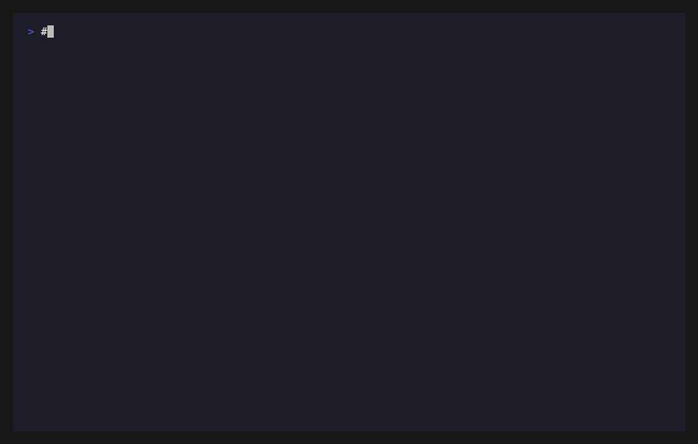

<div align="center">

# claude-replay

### **The undo button you forgot to ask for.**

`claude-replay` reads the raw session JSONLs that **Claude Code already wrote to disk** and uses them as a deterministic event stream. It can rebuild the git history you forgot to make, recover a single file Claude deleted, resurrect an entire `rm -rf`'d project — even export every tool call as a structured event log for AI-agent research.

Byte-perfect. Zero dependencies. Works on any language, any project type.

[](https://github.com/Lightcone-ZhangYifa/claude-replay-plugin/actions)
[](LICENSE)
[](https://docs.claude.com/en/docs/claude-code/plugins)
[](https://www.python.org/)
[](#install)

</div>

---

## Four reasons this exists

### 🚑 1. Rescue mode — you forgot to commit

`git status` is a wall of red. 165 uncommitted files across a week of sessions. You can't tell "the v2 fix you regret" from "the v1 you want to keep." Hand-writing 20 semantic commits from a snapshot means **inventing** history.

You don't have to. **Claude already wrote it down.** Every Edit, every Write, every Bash command was streamed to `~/.claude/projects/-{cwd}/*.jsonl` (and `subagents/*.jsonl` for sub-agents). Replay them in timestamp order against the right baseline commit and you reproduce the exact byte sequence — including every intermediate state that was later overwritten.

```
$ /replay
↳ status:   1274 ops across 6 sessions
↳ plan:     20 commit boundaries from docs/*.md timestamps
↳ execute:  built sandbox in 23s, byte-equal to working tree (0 diff)
↳ apply:    real repo HEAD now: 1205576 (previous tagged as backup)
```


After: a clean `git log --oneline`. `git revert` one feature, `git bisect` to find a regression, push 20 PRs. Your forgotten week became 20 reviewable commits.

---

### 🪢 2. Lifeline — Claude (or you) deleted an important file

You ran `rm` in the wrong terminal. Claude refactored a file out of existence "as cleanup". A Bash one-liner went rogue. Whatever the reason, an important file is gone — and you wrote it through Claude.

```bash
$ claude-replay recover-file --file /home/me/repo/important.py --list-versions
=== /home/me/repo/important.py (10 ops) ===
  2026-05-07T04:55:22  Write       (content: 28375 bytes)
  2026-05-07T04:57:11  Write       (content: 26973 bytes)
  2026-05-07T05:07:59  Edit        (replace 48 chars)
  ...

$ claude-replay recover-file --file /home/me/repo/important.py --output-dir /tmp/restored
RECOVERED /tmp/restored/important.py  (54874 bytes from 10 ops)
```


Recover the latest version, or **any** historical version with `--at-ts 2026-05-06T14:00:00Z`. Every version Claude ever wrote is reachable.

---

### ⚰️ 3. Back from the dead — your entire project is gone

Worst case: you `rm -rf`'d the project. Or moved a disk and forgot to copy. Or a script ate it. Whatever — the working tree is gone. **But `~/.claude/projects/` is untouched.**

If the project was built primarily through Claude, the JSONLs contain enough to reconstruct the entire file tree:

```bash
$ claude-replay recover-project \
    --project-name -home-me-myapp \
    --output-dir ~/recovered-myapp \
    --git-init
Session dir: /home/me/.claude/projects/-home-me-myapp
Original project root (inferred): /home/me/myapp
Files with recoverable ops: 174
Recovered 174 files into ~/recovered-myapp
Initialized git repo at ~/recovered-myapp with one snapshot commit.
```



Then chain into commit-history reconstruction (use case #1):

```bash
cd ~/recovered-myapp
claude-replay execute --apply
```

The result is a fully-recovered project **with semantic commit history**. Information loss limited to: (a) files Claude never touched (typically initial scaffolding or vendored deps), (b) files whose first op was `Edit` rather than `Write` — Claude saw them but never wrote them from scratch.

---

### 🔬 4. Research mode — you study AI agent behavior

Claude Code's session JSONLs capture **months of real human-agent collaboration** on real codebases — including the messy parts: failed edits, sub-agent escalations, context compactions, mid-task pivots, multi-day workflows. `claude-replay analyze` is your structured tap.

```bash
$ claude-replay analyze --format stats | head -15
Total events: 2874
By origin: main=2280  subagent=594

By tool:
    1124  Bash                success=1119 ( 99.6%)
     670  Read                success=668 ( 99.7%)
     585  Edit                success=564 ( 96.4%)
     206  TaskUpdate          success=206 (100.0%)
     153  Write               success=143 ( 93.5%)
      19  Agent               success=19 (100.0%)
```


Pipe JSONL into `jq` / `pandas` / `duckdb`. Per-tool failure rates, retry patterns, sub-agent delegation graphs, time-gap distributions — all derivable. See [`docs/researchers.md`](docs/researchers.md) for the full event schema and example analyses.

---

## How it works (principle level)

```
┌──────────────────────────────────────┐         ┌──────────────────────────┐
│  ~/.claude/projects/-{cwd}/          │         │  /tmp/claude-replay-*/   │
│    *.jsonl  ─── main session         │  read   │  (sandbox clone of       │
│    subagents/*.jsonl                 │  ─────► │   your repo @ baseline   │
│                                      │         │   commit)                │
│  Each line = one assistant or user   │         │                          │
│  message; tool_use blocks contain    │         │  apply ops in ts order:  │
│  exact tool inputs.                  │         │    Write → set bytes     │
└──────────────────────────────────────┘         │    Edit  → str.replace   │
                                                  │    MultiEdit → seq.     │
                                                  │    Bash  → bash -c      │
                                                  └──────────┬───────────────┘
                                                             │
                                                             ▼
                                                  ┌──────────────────────────┐
                                                  │  diff -r sandbox repo    │
                                                  │  must be byte-equal      │
                                                  │      (== 0 entries)      │
                                                  └──────────┬───────────────┘
                                                             │ approve
                                                             ▼
                                                  ┌──────────────────────────┐
                                                  │  git fetch sandbox       │
                                                  │  git reset --hard        │
                                                  │  (real repo gets the     │
                                                  │   commit chain;          │
                                                  │   previous HEAD tagged)  │
                                                  └──────────────────────────┘
```

Each op was originally applied to a deterministic input state. Replaying it against the same starting state produces the same bytes. We don't infer or summarize — we re-execute. **Intermediate states are preserved as their own commits**, because each commit boundary snapshots the timeline state at that point, not the final state. See [`docs/architecture.md`](docs/architecture.md) for the full mechanism.

---

## Install

### As a Claude Code plugin (recommended)

```
/plugin marketplace add Lightcone-ZhangYifa/claude-replay-plugin
/plugin install claude-replay@claude-replay-plugin
```

Slash commands you'll get:
- `/replay` — guided end-to-end (status → plan → confirm → build → verify → apply)
- `/replay-status` — what's in your session JSONLs (read-only)
- `/replay-plan` — preview the proposed commit chain (read-only)
- `/replay-execute` — build chain in sandbox, verify byte-equality, optionally `--apply`
- `/replay-recover-file` — restore a deleted/lost file
- `/replay-recover-project` — resurrect an entire `rm -rf`'d project
- `/replay-analyze` — structured event export for research

### As a standalone CLI

```bash
git clone https://github.com/Lightcone-ZhangYifa/claude-replay-plugin
sudo ln -s "$PWD/claude-replay-plugin/scripts/replay_engine.py" /usr/local/bin/claude-replay
sudo chmod +x /usr/local/bin/claude-replay

claude-replay --help
```

**Requirements**: Python 3.10+, `git`, `bash`. **No external Python packages.** Linux + macOS supported (Windows via WSL).

---

## Boundary strategies (rescue mode)

| Strategy        | When to use                                           | CLI flag                          |
|-----------------|-------------------------------------------------------|-----------------------------------|
| `doc-files`     | Each new `docs/<feature>.md` = one commit (default)  | `--boundary-glob "docs/*.md"`    |
| `time-gap`      | Sessions without docs                                 | `--gap-minutes 30`                |
| `user-approve`  | "Approve" in user messages = boundary                 | `--approve-regex "approve\|lgtm"` |
| `one-shot`      | Bare-minimum recovery — one big commit                | —                                 |
| `manual`        | Full control via JSON list of timestamps              | `--boundaries-file plan.json`     |

Mix and match: `--after 2026-05-04T15:19:00 --before 2026-05-06T12:00:00` to scope to a specific window.

---

## Safety

1. **The real repo is untouched until you pass `--apply`.** All replay happens in `/tmp/claude-replay-*`.
2. **`--apply` aborts if the rebuilt chain isn't byte-equal to your working tree** (overrideable with `--allow-drift`).
3. **Your previous HEAD is always tagged** as `claude-replay-backup-<unix-ts>` before any history rewrite.
4. **The sandbox runs with `core.hooksPath=/dev/null`** so a slow or failing pre-commit hook can't corrupt the chain mid-replay.
5. **Read-only on Claude's side.** Session JSONLs are never modified.

---

## Real-world numbers

Built to solve exactly this problem in a 165-file working tree spanning **6 Claude Code sessions over 3 days**, including 19 sub-agent invocations.

| Metric | Value |
|---|---|
| Session JSONLs ingested | 103 |
| Total tool calls extracted | 12,264 |
| File-modifying ops replayed | 1,274 |
| Commits produced | 21 |
| Final byte-divergence vs working tree | **0** files |
| End-to-end runtime | **23 seconds** |

---

## What it does NOT do

- **Does not invent commits Claude didn't make.** The chain is a faithful replay of recorded ops, not a re-summarization of the diff.
- **Does not modify your session JSONLs.** Read-only on Claude's side.
- **Does not run your pre-commit hooks during sandbox replay.** A hook failure mid-replay can't corrupt the chain.
- **Does not push to any remote.** You explicitly do that after reviewing.
- **Does not work without git.** The repo must be a git repo with at least one commit (the baseline) — except `recover-project`, which can resurrect into an empty target.
- **Does not recover files Claude only Read but never Wrote/Edited.** No baseline = no recovery for those.

---

## FAQ

**Does this work for sub-agents?**
Yes. JSONLs from `subagents/*.jsonl` are merged into the same chronological timeline.

**What if a `sed -i` command in the original session was complex?**
Most patterns replay perfectly because we re-execute the literal `bash -c` command in the sandbox. For exotic cases, the verification diff catches the divergence.

**What if the user manually edited files outside Claude?**
Those edits won't appear in any JSONL, so they show up as a sandbox-vs-working-tree divergence. Pin them into a final `chore: align with working tree` commit.

**What if I ran claude-replay itself in the session I want to replay?**
Use `--before <ts>` to cap the replay before your own forensic work began.

**Can I undo a `--apply`?**
Yes: `git reset --hard claude-replay-backup-<unix-ts>` (the tag is created automatically before every history rewrite).

**Why not just use `git reflog`?**
`git reflog` only knows about operations on the .git store. Your forgotten work was never committed in the first place — there's nothing in the reflog to recover. The JSONLs are the only source of truth.

**Does this work with project types other than Android/Kotlin?**
Yes. The engine is language-agnostic. It just replays bytes; it doesn't parse what's in the files.

**Windows support?**
Use WSL. The engine relies on `bash` to faithfully re-run captured Bash ops; native Windows shells have different semantics.

**My session JSONLs contain secrets / private content. Is sharing the analyze output safe?**
By default no — `analyze` emits the full input verbatim. Strip `input.content` / `input.old_string` / `input.new_string` and absolute paths before publishing. See [`docs/researchers.md`](docs/researchers.md) for the privacy checklist.

---

## Contributing

PRs welcome. Run `python3 -m pytest tests/ -v` first. New boundary strategies, better Bash heuristics, additional export formats — all wanted. See [CONTRIBUTING.md](CONTRIBUTING.md).

## Star history

If this rescued you, ⭐ helps others find it.

## License

MIT — use it, fork it, ship it.
